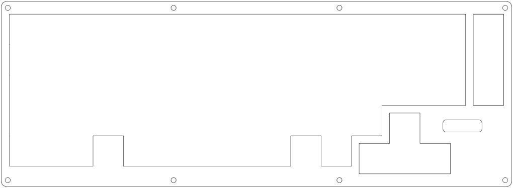

# BROKEY

## I. Demo

* **Top Layer**


* **Plate Layer**


* **Bottom Layer**


* **3D Model**


## II. Components
* 64 switches
* 64 Diodes
* 1 Oled 128x32 - I2C
* 1 Arduino ProMicro Processor

* Case:
  * Top Layer: 320x116x5 mm
  * Plate Layer: 320x116x2 mm
  * Bottom Layer: 320x116x5 mm
  * Using 8 screws to connect layers

## III. KLE RawData
```K
[{c:"#f75454",a:7},"ESC",{c:"#cccccc",a:4},"!\n1","@\n2","#\n3","$\n4","%\n5","^\n6","&\n7","*\n8","(\n9",")\n0","_\n-","+\n=",{a:7,w:2},"Backspace",{x:0.25},"Delete"],
[{w:1.5},"Tab",{a:4},"Q","W","E","R","T","Y","U","I","O","P","{\n[","}\n]",{w:1.5},"|\n\\",{x:0.25,a:7},"Home"],
[{w:1.75},"Win",{a:4},"A","S","D","F","G","H","J","K","L",":\n;","\"\n'",{c:"#f75454",a:7,w:2.25},"Enter",{x:0.25,c:"#cccccc"},"End"],
[{w:2.25},"Shift",{a:4},"Z","X","C","V","B","N","M","<\n,",">\n.","?\n/"],
[{y:-0.75,x:12.5,a:7},"↑"],
[{y:-0.25,w:1.5},"Ctrl",{w:1.25},"Alt",{x:1,c:"#f75454",w:2.75},"",{w:2.75},"",{x:1,c:"#cccccc"},"Menu"],
[{y:-0.75,x:11.5},"←","↓","→"]
```

## IV. QMK Source code
**DELETED**

### note


